import { Card, CardGrid } from '@astrojs/starlight/components';

布拉格（Prague），捷克共和国的首都，以其美丽的建筑、丰富的历史和独特的文化吸引着成千上万的游客。

实时汇率：1刀:0.92欧，1欧:7.88元

时间：2024-06-12 从伦敦出发 2024-06-14 离开
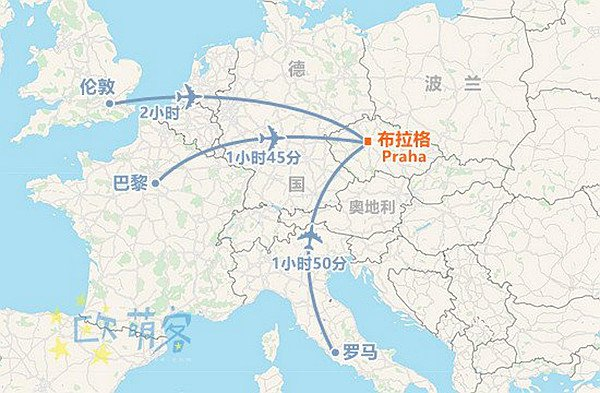
位置：布拉格西北约16公里，约25分钟车程
打车：可用Bolt，Uber，但白天市内经常堵车

## 机场到市区的公共交通

### 方法1：机场快线 AE [Airport Express]

性价比高
- 运营时间：每天7am-9pm，每30分钟一班，单程40分钟
- 票价：CZK100，6-15岁半价，行李免费

### 方法2：公交+地铁

价格便宜
- 票价：买单程90分钟票CZK40，或24/72小时票都可

## 主要景点

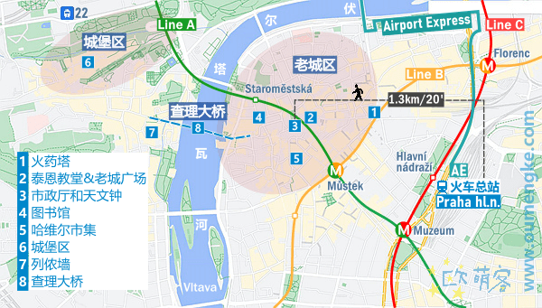

### 布拉格城堡

布拉格城堡是世界上最大的古城堡之一，始建于9世纪。城堡内有圣维特大教堂、老皇宫、圣乔治教堂和黄金巷等景点，是布拉格的象征。

### 查理大桥

查理大桥是布拉格最著名的桥梁，横跨伏尔塔瓦河，连接旧城和小城。桥上有30尊巴洛克风格的雕像，每天都有许多街头艺人在桥上表演。
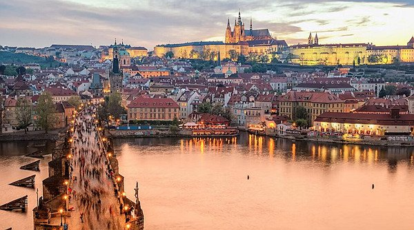

### 老城广场

老城广场是布拉格最热闹的地方之一，四周环绕着美丽的历史建筑和咖啡馆。广场上有著名的天文钟、泰恩教堂和旧市政厅。
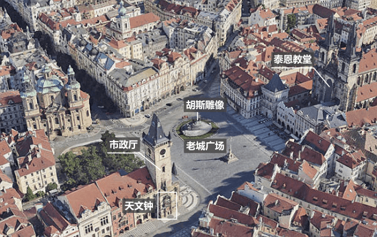
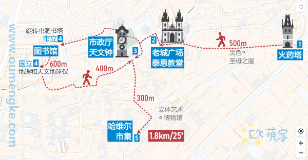

### 小城区

小城区（Mala Strana）位于伏尔塔瓦河的西岸，是布拉格最古老的街区之一。这里有许多迷人的小巷、古老的教堂和宫殿，值得一游。

## 住宿信息

我们将在6月12日入住VN48 Suites by Adrez，6月14日离店。以下是酒店的Google地图位置：

<iframe src="https://www.google.com/maps/embed?pb=!1m18!1m12!1m3!1d2605.1977872072925!2d14.418540115662457!3d50.08781117942595!2m3!1f0!2f0!3f0!3m2!1i1024!2i768!4f13.1!3m3!1m2!1s0x470b94ebc6a93a0d%3A0x400af0f6619e7a0!2sVN48%20Suites%20by%20Adrez!5e0!3m2!1sen!2scz!4v1689254101863!5m2!1sen!2scz" width="600" height="450" style="border:0;" allowfullscreen="" loading="lazy" referrerpolicy="no-referrer-when-downgrade"></iframe>

## 布拉格玩什么，主要景点

布拉格市区被伏尔塔瓦河分成左右两部分。河右岸集中在老城区，它是世界文化遗产，适合打卡拍照；河左岸集中在城堡区，是城市的制高点，可俯瞰周边景色。连接两岸的是地标建筑：查理大桥，桥上生意兴隆，夜景美。

<CardGrid>
  <Card>
    <h3>火药塔</h3>
    
古迹，适合途径打卡拍照，约玩10分钟

    
    <input type="checkbox" /> 打卡
  </Card>
  <Card>
    <h3>泰恩教堂 & 老城广场</h3>
    
必经，老城中心，约玩30分钟

    
    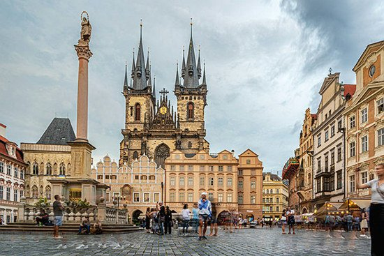
    <input type="checkbox" /> 打卡
  </Card>
  <Card>
    <h3>市政厅和天文钟</h3>
    
地标建筑，特色景点，约玩30-60分钟

    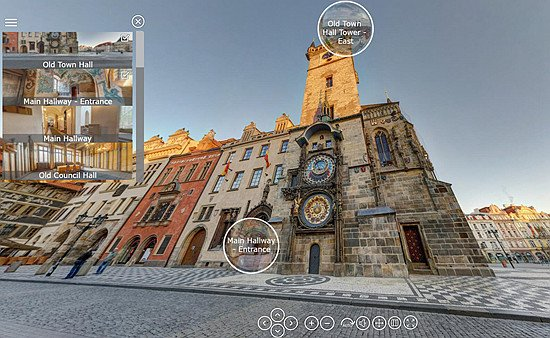
    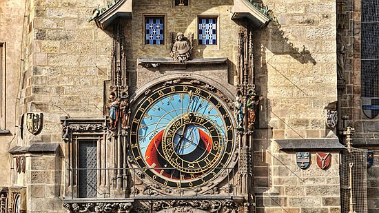
    <input type="checkbox" /> 打卡
  </Card>
  <Card>
    <h3>图书馆</h3>
    
内部布置非常有特色，打卡拍照10分钟, 总共有三个不同的图书馆

    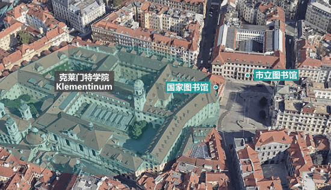
    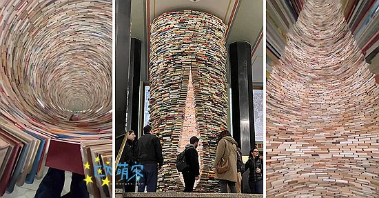
    <input type="checkbox" /> 打卡
  </Card>
  <Card>
    <h3>哈维尔市集</h3>
    
有露天市场，逛吃买非常热闹，约玩1小时

    
观看相关视频：[哈维尔市集介绍](https://www.youtube.com/watch?v=Lk5TRtucgm8)

    <input type="checkbox" /> 打卡
  </Card>
  <Card>
    <h3>城堡区</h3>
    
包含布拉格城堡，花园，广场等；约玩2小时

    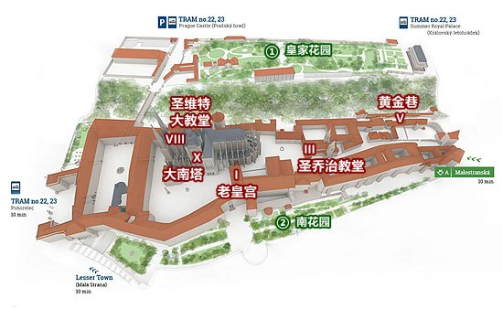
    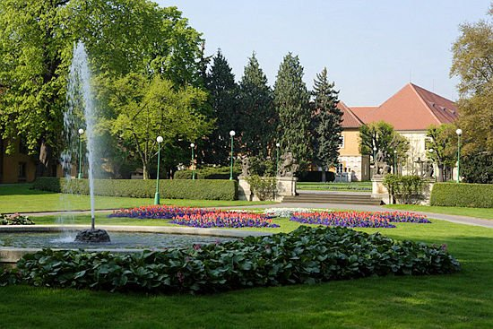
    <input type="checkbox" /> 打卡
  </Card>
  <Card>
    <h3>列侬墙</h3>
    
涂鸦墙，约翰·列侬纪念地；10-30分钟

    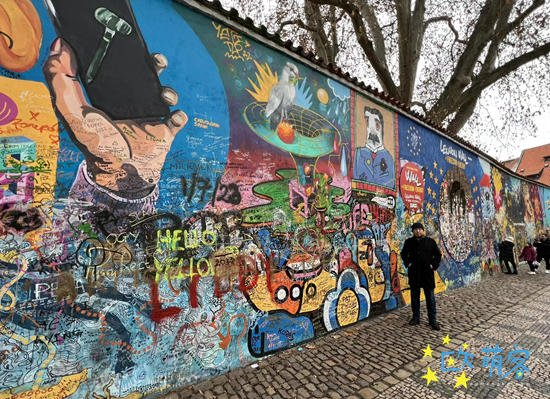
    <input type="checkbox" /> 打卡
  </Card>
  <Card>
    <h3>查理大桥</h3>
    
地标，哥特式石桥，步行桥；30-60分钟

    
    <input type="checkbox" /> 打卡
  </Card>
</CardGrid>

## 布拉格旅游行程

一般1-2晚可以完成游玩，高强度1天全天也可，时间比较自由看具体情况而定。

### Day 1

**下午到达布拉格**：
- 先放置行李后可以根据实际情况修改行程
- 城堡区 → 列侬墙 → 查理大桥看日落和夜景
- 步行约3km，45分钟，下坡方向省力

### Day 2

**老城区[步行即可] + 其它景点**

**上午**：
- 火药塔
- 泰恩教堂和老城广场
- 市政厅和天文钟
- 图书馆

**下午**：
- 哈维尔市集+其他喜爱的景点
- 步行约2km，30分钟，道路平坦

## 美食推荐

布拉格的美食不仅仅是啤酒和烤猪膝，这里还有许多美味的捷克传统菜肴：

- **烤鸭**（Pecena Kachna）：配有红甘蓝和土豆饺子，是捷克的经典美食。
- **牛肉炖酱**（Svickova）：牛肉配以浓郁的奶油胡萝卜酱和面包饺子。
- **捷克啤酒**：布拉格是啤酒爱好者的天堂，当地的Pilsner和Budweiser Budvar很有名。

## 旅行建议

- **交通**：布拉格的公共交通系统非常便利，地铁、电车和公交车覆盖全城。建议购买一张短期通票，可以无限次乘坐。
- **语言**：虽然捷克语是官方语言，但大多数旅游景点的工作人员都会讲英语。
- **货币**：捷克克朗（CZK）是布拉格的货币，但许多地方也接受欧元。不过建议提前兑换一些捷克克朗，以便支付小额消费。
