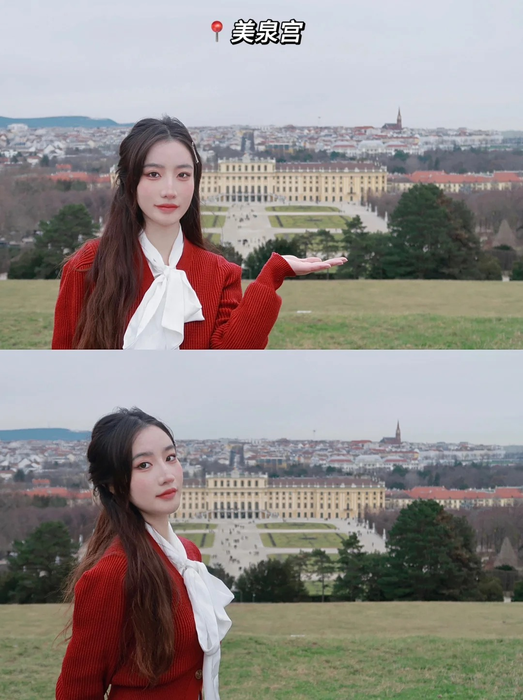
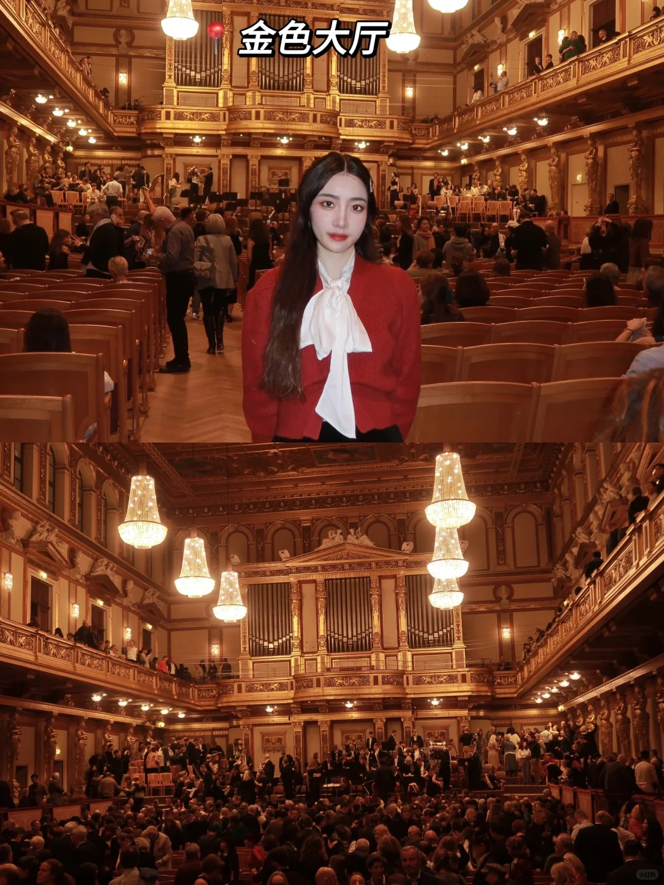
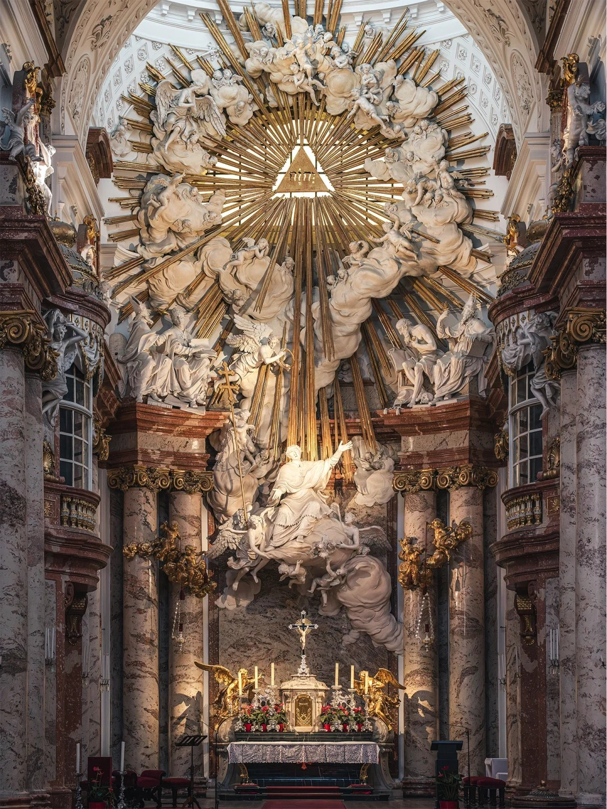
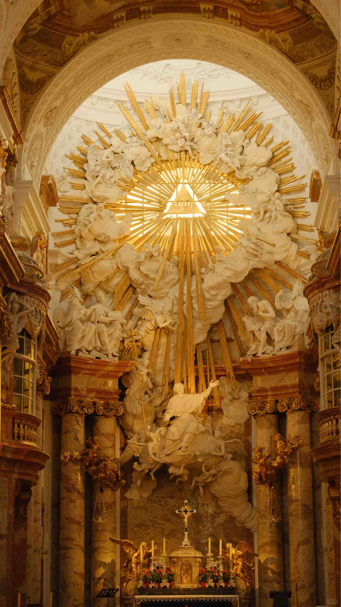
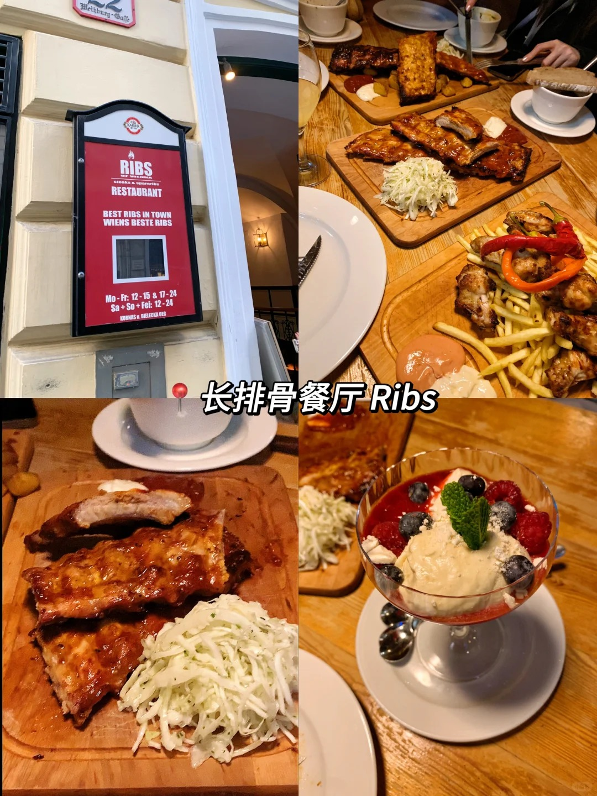

import { Card, CardGrid } from '@astrojs/starlight/components';

维也纳（Vienna

时间：2024-06-14 从布拉格出发 2024-06-16 离开

## 住宿信息

Adina Serviced Apartments Vienna

  <iframe 
    src="https://www.google.com/maps/embed?pb=!1m28!1m12!1m3!1d10630.318170214128!2d16.37246971378127!3d48.19903293812947!2m3!1f0!2f0!3f0!3m2!1i1024!2i768!4f13.1!4m13!3e3!4m5!1s0x476d07e6bcd6878b%3A0x72f9ec1f0e29e56d!2sVienna%20Train%20Station%2C%201100%20Wien%2C%20Austria!3m2!1d48.1858391!2d16.3772888!4m5!1s0x476d07d8bc09c1cf%3A0x9fa0f4bc0d2926f!2sAdina%20Serviced%20Apartments%20Vienna!3m2!1d48.2008907!2d16.3697218!5e0!3m2!1sen!2sat!4v1622927927395!5m2!1sen!2sat" 
    style={{ width: '100%', height: '100%', border: '0', position: 'absolute' }}
    allowfullscreen="" 
    loading="lazy">
  </iframe>

距离1.3km，步行18min

## 行程详情

接下来的部分将用一个可互动式的Google Map来介绍主要景点和可能的行程。其中红色的点是主要的拍照景区，蓝色的点是美食餐厅，黄色的点是其他包括纪念品商店的地点。我们可以灵活前往。

  <iframe 
    src="https://www.google.com/maps/d/embed?mid=1uP8M70nyvyub8ZyUZB5Zpv8XG57C99M&ehbc=2E312F" 
    style={{ width: '100%', height: '100%', border: '0', position: 'absolute' }}
    allowfullscreen="" 
    loading="lazy">
  </iframe>

### 景点
- 美泉宫Schönbrunn Palace
  - 17欧，记得拿讲解耳机（免费）内部是不让拍照的，比较好的拍照机位是建筑前和上山之后的俯拍，较远。
  

- 金色大厅 
  - 
  
- Karlskirche
  - 拍照很出片的教堂
  
  

### 美食
- Ribs of Vienna
  - 长排骨餐厅，好吃量大
  - 人均 20-30 欧
  
